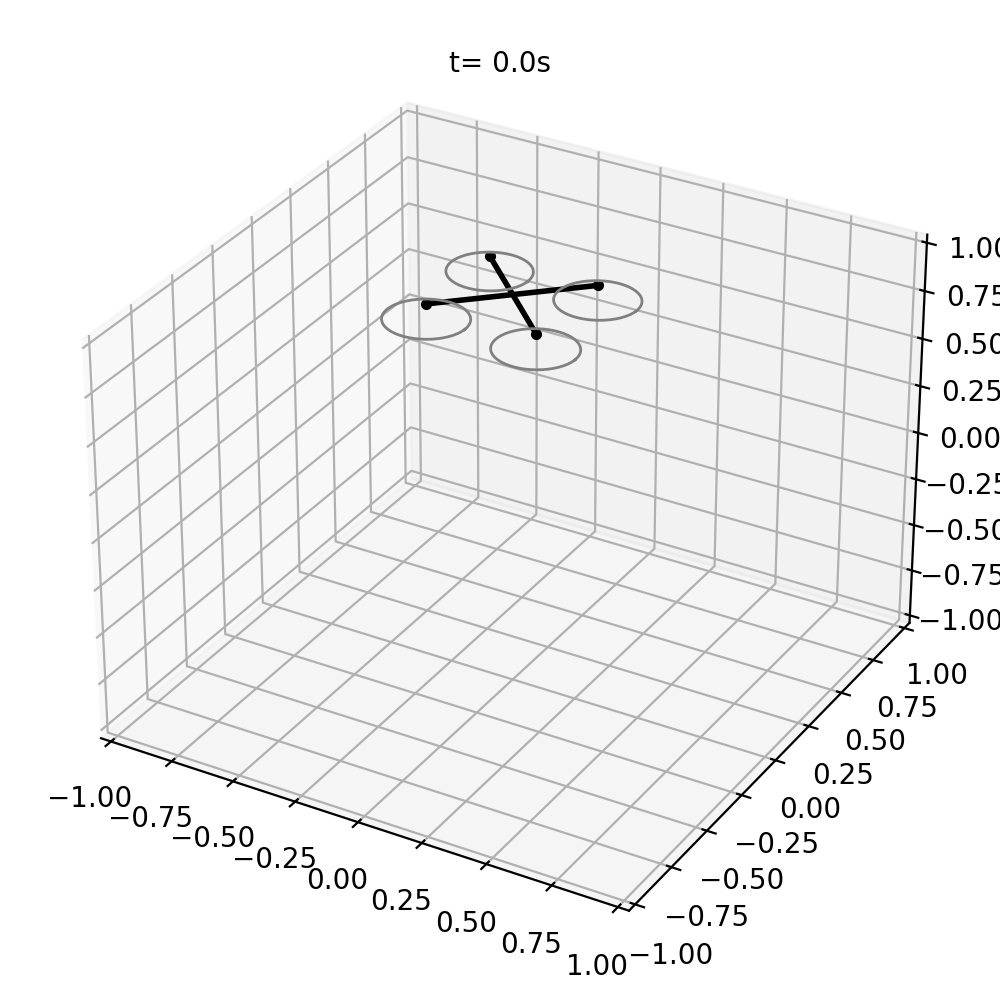
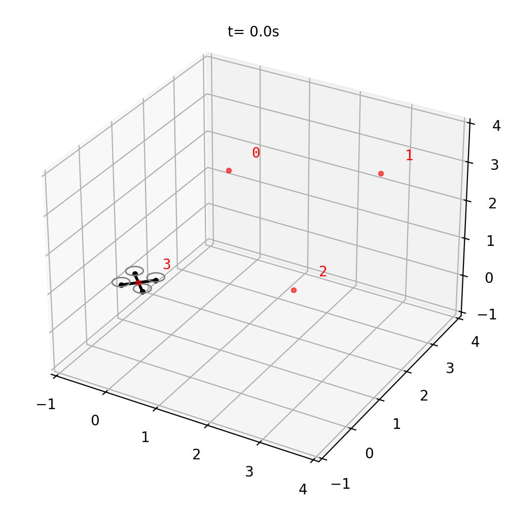
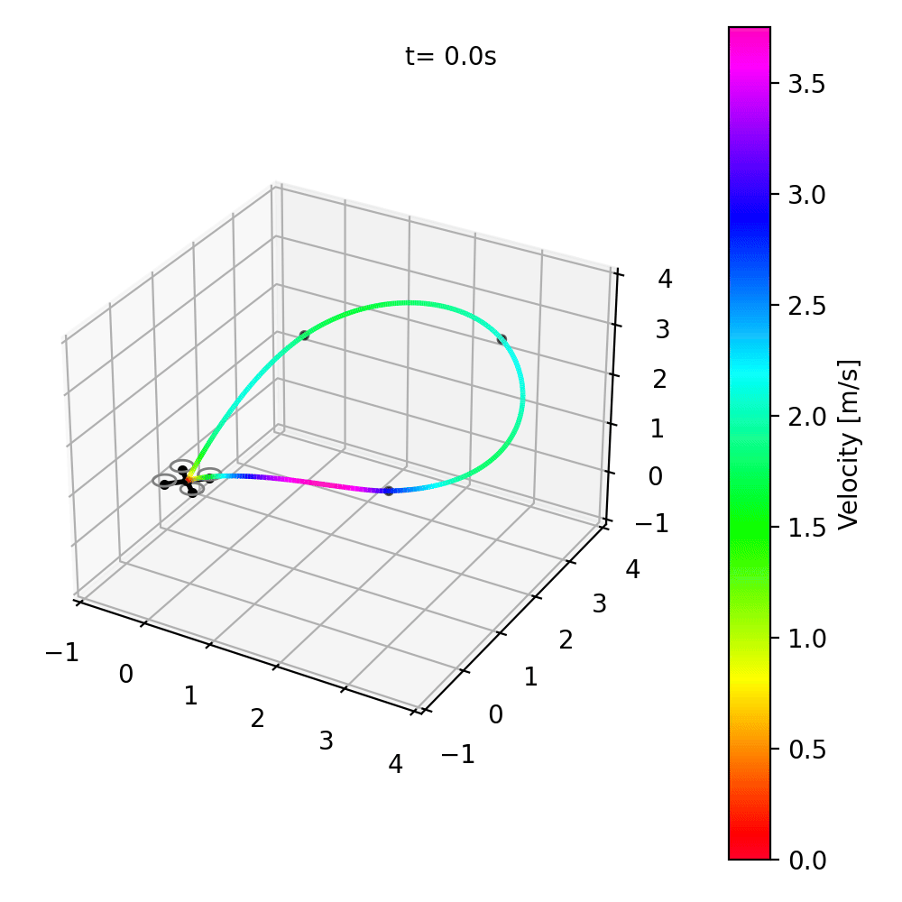

# UAV Controls 

| Upside-Down Initialization | Waypoint Following | Trajectory Tracking |
|:-------:|:-------:|:-------:|
|  |  |  |
| Recover from 180º Roll | Follow positional waypoints | Track min-snap trajectory |

**UAV Controls** is a Python repository designed to implement various controllers and dynamics models for Unmanned Aerial Vehicles (UAVs) based on popular research papers and methods in underactuated robot control. 

## Contents
The repository contains relevant control, dynamics, and planner implementations for simulation of a quadrotor aerial vehicle. Using the same controller, the UAV can perform point stabilization, waypoint tracking, and trajectory tracking based on the planner that's used. We can also optionally use a control allocator which takes into account the thrust limits of the rotors when using a non-optimal-control-based scheme. 

## Installation

This repository depends on my [hybrid ODE solver](https://github.com/micahreich/hybrid_ode_sim/tree/main) Python library which is used as the backend for the simulation and rendering pipelines. Follow the Installation of that repository to use it as a dependancy. 

### Setup

Clone the repository locally:

```bash
git clone https://github.com/micahreich/uav_control.git  # for https
git clone git@github.com:micahreich/uav_control.git      # for ssh
```

Create a Python virtual environment and install dependancies:
```bash
cd uav_control                  
python -m venv pyenv  # create a virtual environment
pip install -e .      # install requirements
```

Now you can run any of the examples locally.

## References
1. [Geometric Adaptive Tracking Control of a Quadrotor Unmanned Aerial Vehicle on SE(3) for Agile Maneuvers](https://arxiv.org/abs/1411.2986)
2. [Control of Complex Maneuvers for a Quadrotor UAV using Geometric Methods on SE(3)](https://arxiv.org/abs/1003.2005)
3. [Geometric Controls of a Quadrotor UAV with Decoupled Yaw Control](https://ieeexplore.ieee.org/document/8815189)